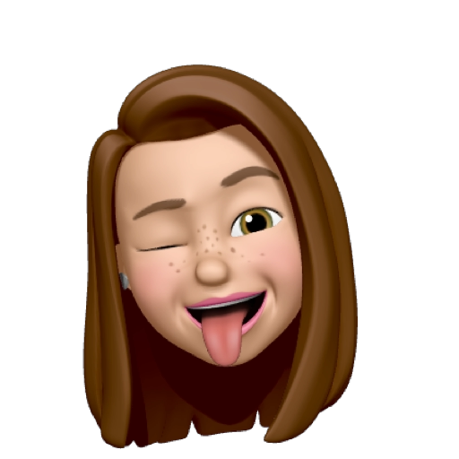

<h2 align='center'> Hi, I´m Silvia 👋 </h2>


<p><em>Full Stack Python Developer</em>  :computer:</p>


[](https://www.linkedin.com/in/silvia-sanjose)
</br>
</br>

```javascript
const silvi = {
  pronouns: "she" | "her",
  
  code: [ HTML, CSS, Javascript, Python, Java],
  
  technologies: {
  
      frontEnd: {
         css: ["Bootstrap", "Sass"], 
         js: ["Npm", "React"]
      },
      
      backEnd: {
         java: ["WindowbuilderApp"],
         python: ["Django", "Flask", "PyQt5"],
      },
      
      databases: ["MySQL"],
      
      bots: ["Dialogflow", "AWS", "Alexa"]
   },
   
  tools: [Trello, Jira, Agile, Git, Scrum]
}
```
</br>


</br></br>

<em>This README was generated with ❤️ by Silvia Sanjosé</em>


<!--
COMMENT
*Linkedin círculo:
<a href="https://www.linkedin.com/in/silvia-sanjose" target="blank"></a>

*Cuadro con imagen/enlacea perfil (colaborador):
<kbd><a href="https://github.com/SilviaSanjose"></a></kbd>


challenge: "I'm working towards being able to run a marathon.", 
challenge: "I am doing the #100DaysOfCode challenge focused on react and typescript"

---  para linea entera
-->


